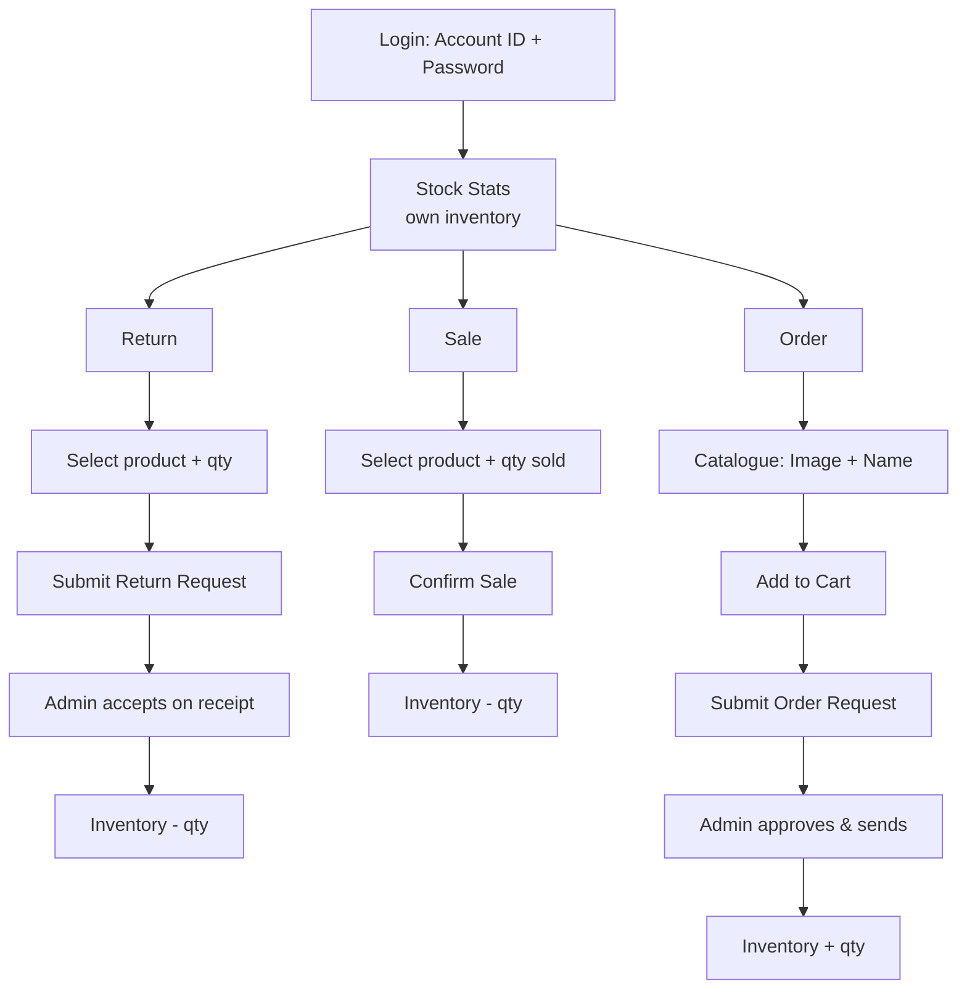
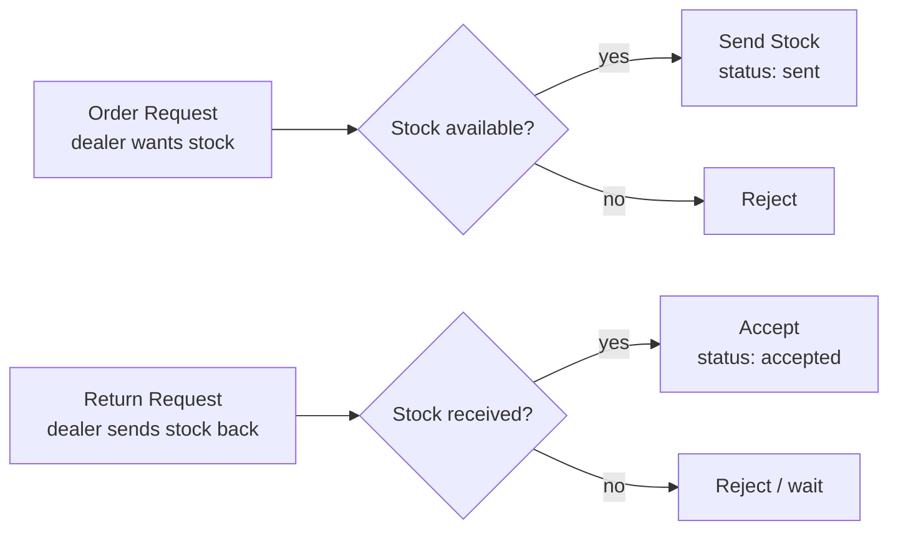
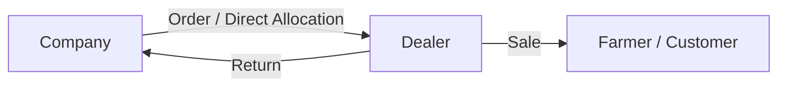
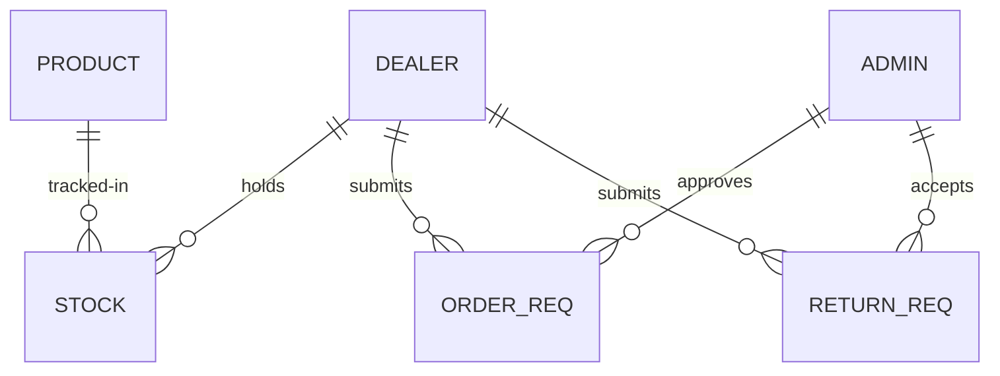

# Agriculture Dealer Stock Management & Distribution System — Blueprint

## 1. Overview

A digital platform for an agriculture company to manage its network of dealers
who sell seeds, fertilizers, and other agricultural products. The system connects
three parts through one shared Supabase database:

- **Public Company Website** — informational only (About, Products, Company Details, Contact)
- **Admin Portal** — company staff control center
- **Dealer Portal** — individual dealer inventory tool

**Core principle:** the system tracks only *products, quantities, and stock
movement*. No pricing, cost, payment, invoicing, or money tracking anywhere.

---

## 2. Architecture (simple by design)

```text
/public/*.html     Company website (read-only info)
/admin/*.html      Admin portal
/dealer/*.html     Dealer portal
        |
     Vercel        (static hosting — one project, no build step)
        |
    Supabase       (Auth + PostgreSQL + RLS + Storage + Realtime)
```

- Three folders, **HTML files only**. Every page embeds its own CSS in a
  `<style>` block and its own JS in a `<script>` block. No frameworks, no build
  step, no server-side code.
- Pages talk to Supabase **directly from the browser** with the public anon
  key; **Row Level Security (RLS)** is the security wall.
- **No Cloudflare** — no Worker, no R2, no CDN. Product images are stored in
  **Supabase Storage**.
- All stock math runs inside **Postgres functions (RPCs)** — the browser never
  computes stock itself (see `backendStack.md` §5).

---

## 3. User Roles

### 3.1 Dealer
- Logs in with **Account ID** + **Password** (issued by the company admin; the
  Account ID maps to a login email — see `backendStack.md` §7).
- First screen after login = **Stock Stats** (read-only summary of own inventory).
- Only **3 actions** below the stats: Return, Sale, Order.
- Cannot see other dealers' stock, cannot set prices, sees only products the
  admin created.
- All stock-in originates from the **admin** (order approval or direct
  allocation), never from arbitrary external sources.

### 3.2 Admin (company staff)
- Full control: products (crops), dealers, orders, returns, dashboard,
  direct allocation, redistribution.
- Dealer login accounts are provisioned by the company admin in the Supabase
  Dashboard (`backendStack.md` §7); everything else happens in the Admin Portal.

### 3.3 Public visitor
- Views the company website only. No login, no buying.

---

## 4. Dealer Portal — Detailed Behavior

Dealer lands on a **Stock Stats** screen first, then has 3 action options.

### 4.0 Stock Stats (dealer landing view)
Read-only summary of the dealer's own inventory, shown immediately after login:

- Each product they hold, with current quantity
- Low-stock indicator (quantity at or below the configured `LOW_STOCK_MAX`)
- Recent stock movement (in/out) from `stock_movements`, refreshed live via
  Supabase Realtime

This is a view only — no edits. The 3 actions below operate on this inventory.

### 4.1 Return (stock OUT, to company)
Used when the dealer sends stock *back to the company* (e.g., excess or
defective products). The dealer builds a **multi-item return cart** (add
products + quantities, adjust, remove), then submits one Return Request. It
reduces the dealer's inventory, but only after the admin accepts it.

Flow: Dealer clicks "Return" → builds a return cart (one or more products) →
submits Return Request → admin sees the request → admin physically receives
the stock → admin accepts → dealer inventory reduced automatically.

```text
Current Stock - Returned Quantity = New Stock      (on admin accept, per item)
```

Example: Current 100 - Returned 50 → New Stock 50.
Stock leaves the dealer's inventory only when the admin accepts, not when the
request is submitted. Until then the request is `pending`. A retried double
click can't create a duplicate (`client_ref` guard).

### 4.2 Sale (stock OUT)
Used when the dealer *sells* to farmers/customers. The dealer builds a
**multi-item sale cart** (several products in one sale), then submits — all
items are deducted in one atomic database transaction.

```text
Current Stock - Sold Quantity = Remaining Stock    (instant, per item)
```

Example: Current 150 - Sale 40 → Remaining 110.

### 4.3 Order (request stock from company)
Used when the dealer needs more products.

Flow: Dealer clicks "Order" → product catalogue opens (all admin-created
products, shown as Image + Name) → dealer adds products to cart → submits
Order Request → admin receives the request → admin sends stock (approves) →
dealer inventory updated automatically.

Dealer CANNOT take stock without admin approval.

---

## 5. Admin Portal — Modules

### 5.1 Dashboard & Analytics
Summary view of the whole network:

- Total dealers / total products
- Dealer-wise stock (how much each dealer holds)
- Stock movement (in/out direction)
- Low-stock dealers (total at/below `LOW_STOCK_MAX`) and excess-stock dealers
  (total at/above `EXCESS_TOTAL`)

Use case: move stock from excess dealers to low-stock dealers to prevent waste
and shortages (redistribution action lives here — §6).

### 5.2 Products (Crops)
A product *is* a crop — there is no separate crop category. Each product the
admin creates (e.g., "Rice", "Wheat", "Cotton", "Cotton Seed Supreme") is what
dealers see in their order catalogue and what stock is tracked against.

Admin can:
- Add product (name + image; image uploaded to Supabase Storage)
- Edit product (name + image)
- Remove/deactivate product
- View product stats: for any product, **which dealers hold it and how much**

No price, cost, or money. Products only carry a **Name** and an **Image**.

### 5.3 Dealer Management
Controls who can use the Dealer Portal.

| Field | Meaning |
|-------|---------|
| Shop Name | Dealer's shop name |
| Dealer Name | Person running the shop |
| Village / Mandal / District | Location |
| Account Details | Banking reference (informational only — system has no payments) |
| Account ID | Login username (issued by admin) |
| Password | Set in the same form — creates the login automatically |
| Initial stock | Optional products + quantities to seed on creation |

- **Create dealer** builds the login end-to-end: Supabase Auth user + role
  claims + the `dealers` row + optional initial stock, all in one step
  (`backendStack.md` §5.8, §7). No manual Dashboard provisioning.
- **Edit dealer:** update any field, including product quantities.
- **View dealer activity:** current inventory, sales history, return history,
  order history, net stock movement — per-dealer transparency without the
  dealer seeing anyone else's data.
- **Direct allocation** (§5.6) is multi-item and lives on the dealer's detail view.
- Dealers are **searchable** by name / Account ID / location.

### 5.4 Order Request Management
Admin sees incoming dealer requests:

```text
Dealer A requested:
  Seed X — Quantity: 200
```

Admin checks availability and sends stock (approves). Order status:
`pending` → `sent` (or `rejected`).

### 5.5 Return Request Management
Mirrors Order Request Management, but for stock flowing *back* to the company.
Admin waits until the physical stock is received, then **Accepts** (dealer
inventory reduced) or **Rejects** (stock not received / mismatched — no stock
movement). Return status: `pending` → `accepted` / `rejected`.

### 5.6 Direct Allocation
Admin can proactively send stock to any dealer without a request: build a
**multi-item allocation** (products + quantities), then send — one atomic
transaction. This enables balancing stock across the network and pushing new
products.

---

## 6. Stock Redistribution System

Admin moves stock directly between dealers. The admin builds a **multi-item
move** (several products at once, each with a quantity) and submits — `source −qty`,
`target +qty` for every item in **one atomic transaction** (any item that can't
be honoured rolls the whole move back):

```text
Move 300 of A → B:   Dealer A: 900 → 600     Dealer B: 50 → 350
```

Each move writes a **paired** `REDISTRIBUTE` movement (`-qty` source, `+qty`
target) sharing one reference id, so the transfer is reconstructable in the
audit trail. Triggered from the Dashboard's low-stock ↔ excess-stock panels
(admin clicks "Move stock").

Three stock-movement methods:

| Method | Direction | Initiator | How |
|--------|-----------|-----------|-----|
| Order | Company → Dealer | Dealer | Dealer orders, admin approves & sends |
| Direct Allocation | Company → Dealer | Admin | Admin sends stock without request |
| Return | Dealer → Company | Dealer | Dealer returns, admin accepts on receipt |

---

## 7. Data Model (what is stored)

- **Dealer:** shop name, dealer name, village, mandal, district, Account ID,
  per-product stock quantity.
- **Product (a crop):** name + image.
- **Stock:** dealer ↔ product mapping with quantities; sale history (stock out
  to customers); return history (stock out, back to company); order requests
  with status and timestamps.
- Full schema: `backendStack.md` §4. The company's own warehouse stock is
  tracked **manually outside the system** — there is no company-stock table.

---

## 8. Out of Scope (explicit boundaries)

| Feature | Included? |
|---------|-----------|
| Product quantities | Yes |
| Stock movement | Yes |
| Dealer management | Yes |
| Order requests | Yes |
| Dashboard & reports | Yes |
| Prices / Cost | No |
| Payments / Transactions | No |
| Invoicing / Billing | No |
| Public online sales | No |
| Farmer direct purchases | No |

---

## 9. Frontend Navigation & Page Map

Both portals are tab-based; each tab is one HTML page
(`UIUX.md` §4.2 for layout rules).

```text
public/   index.html   about.html   products.html   contact.html
dealer/   index.html (login)   stock.html   sale.html   order.html   return.html
admin/    index.html (login)   dashboard.html   products.html   dealers.html   orders.html   returns.html
```

- **Dealer navbar tabs:** Stock Stats · Return · Sale · Order
  (My Orders / My Returns lists live inside the Order / Return pages).
- **Admin navbar tabs:** Dashboard · Products · Dealers · Orders · Returns.
- Direct allocation = multi-item action on a dealer's detail view (Dealers
  page); Redistribute = multi-item action on the Dashboard.
- **Search everywhere:** dealer/product/order/return lists and the order
  catalogue have client-side search boxes.
- **Shared rule:** both portals read/write the same Supabase database, so a
  change in one tab reflects immediately in the other portal (the dealer
  Stock Stats page updates live via Realtime — `backendStack.md` §11).

---

## 10. System Diagrams

### 10.1 Dealer Portal Flows


### 10.2 Admin Approval Queue (Order & Return)


### 10.3 Stock Movement Matrix


### 10.4 Data Model


---

## 11. Reference Scenario

1. Admin adds product (crop) "Cotton Seed Supreme" with an image
   (uploaded to Supabase Storage).
2. Dashboard shows Dealer B low (20 units), Dealer C excess (800 units).
3. Dealer A submits a Return of 100 Rice Seed to the company; admin accepts on
   receipt, inventory 200 → 100.
4. Dealer A records Sale -50 Rice Seed (300 → 250).
5. Dealer B orders 200 Cotton Seed.
6. Admin approves and sends 200; B: 20 → 220.
7. Admin reviews dashboard and redistributes Dealer D's idle stock to Dealer B.

---

## 12. Purpose Statement

Digitize the agriculture dealer network so the company always knows where every
product is, dealers manage daily operations easily, and stock is smartly
redistributed to maximize sales and minimize waste — focused purely on
inventory and distribution, never money.

---

## 13. Build Notes (spec vs implemented)

This blueprint describes a **static-HTML build** (this doc supersedes the older
Next.js + Cloudflare design of the same project):

- The three folders `public/`, `admin/`, `dealer/` contain only `.html` files
  with embedded CSS/JS (`backendStack.md` §2).
- All stock correctness lives in the Postgres RPCs of `supabase/schema.sql`
  (`backendStack.md` §5); pages only read data and call RPCs.
- **Multi-item everywhere:** sale, return, order, allocate and redistribute
  all accept several products in one atomic operation.
- **Provisioning is automated:** `api/create-dealer` + `api/bootstrap-admin`
  (Vercel Functions) create logins; no manual Supabase Dashboard steps
  (`backendStack.md` §5.8, §7).
- **Live updates:** the Stock Stats recent-movement feed (§4.0) plus Realtime
  re-rendering when the admin sends stock, accepts a return, or redistributes.
- **Search / filters / niceties:** search boxes on all admin lists, the order
  catalogue and dealers; show-password + password-manager on logins; image
  URL **or** file upload with a live preview for products.
- **Replay-safety + concurrency:** `client_ref` on sale/order/return; RPCs
  return `quantity_before/after` and distinguish `INSUFFICIENT_STOCK` (422)
  from `CONCURRENT_MODIFICATION` (409).
- **Health + tests:** `GET /api/health` and `tests/e2e.mjs` cover the backend.
- UI must follow `UIUX.md` — tokens copied identically into every page.